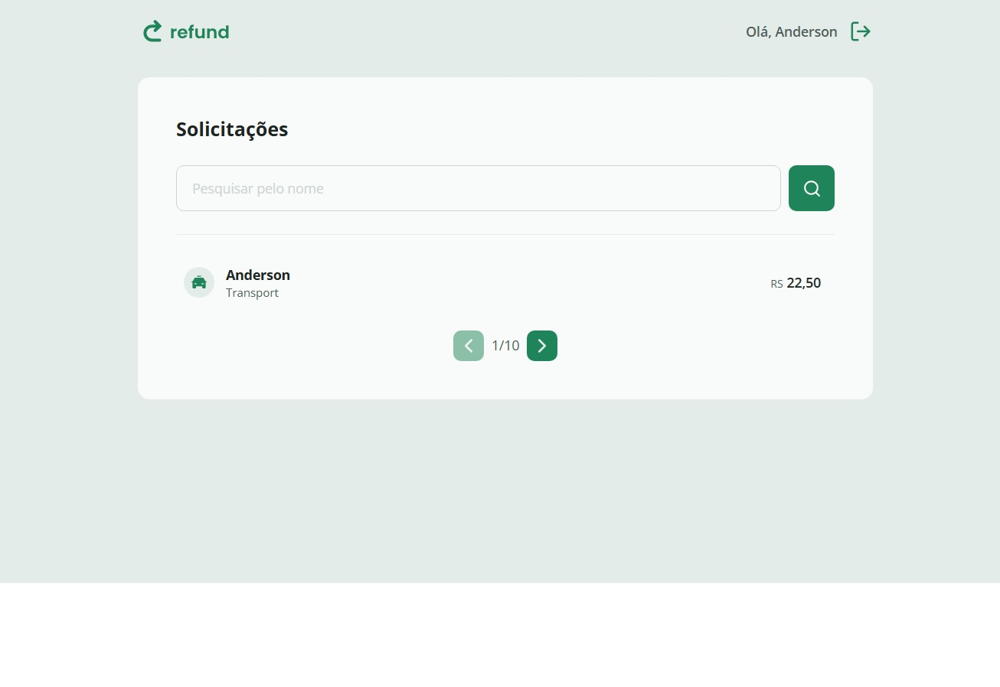
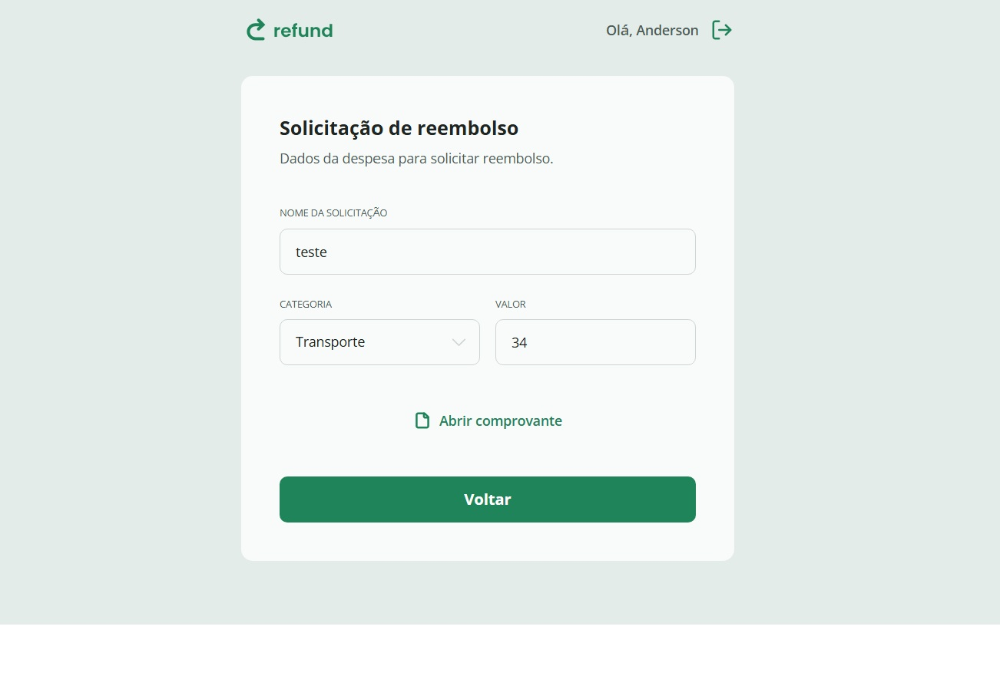

# Refund UI 💼





Aplicação web para gerenciamento e solicitação de reembolsos, desenvolvida com React, TypeScript e Tailwind CSS. A interface simula diferentes perfis de acesso e organiza o fluxo da aplicação por meio de rotas dinâmicas e componentização reutilizável.

O projeto demonstra organização estrutural, separação de responsabilidades e tipagem segura, com foco em arquitetura Front-end e clareza no fluxo de navegação.

---

## Tecnologias

**Linguagem:**
- TypeScript

**Frontend:**
- React
- React Router DOM
- Tailwind CSS

**Ferramentas:**
- Vite
- Git
- VS Code
- pnpm

---

## Sobre o projeto 📋

O Refund UI simula um sistema interno de solicitação de reembolso com separação de perfis (Manager e Employee).

Conceitos praticados:

- Organização de rotas por perfil de usuário  
- Uso de rotas dinâmicas (`/refund/:id`)  
- Captura de parâmetros com `useParams`  
- Navegação programática com `useNavigate`  
- Componentização reutilizável  
- Estrutura de projeto organizada e escalável  
- Estilização com Tailwind CSS  

O projeto foi desenvolvido como prática dos conceitos apresentados no curso, com foco na aplicação real de organização e fluxo em React.

---

## Como rodar o projeto 🔧

### 📥 Clonar o repositório

```bash
git clone https://github.com/Andersondev123/refund-ui.git
```
### Execute o comando de instalação
```bash
pnpm install
```
### Execute o projeto
```bash
pnpm dev
```

